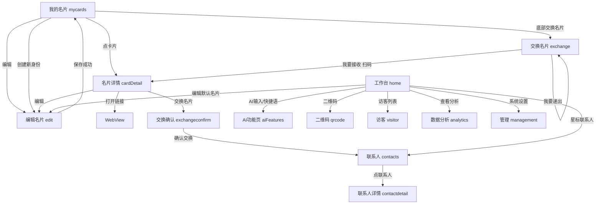

# 壹席eSeat 小程序页面功能流转图

更新日期：2026-03-27  
用途：帮助我们快速看清“每个页面做什么、从哪里进入、点了会跳去哪里、接到哪个接口、当前做到哪一步”。

## 1. 页面总览表

| 页面 | 路径 | 主要功能 | 主要入口 | 主要跳转 | 数据/服务 | 当前状态 |
|---|---|---|---|---|---|---|
| 我的名片 | `pages/mycards/mycards` | 多身份名片列表、设默认、编辑、分享、删除、进入交换 | TabBar | 名片详情、编辑页、交换页 | `cardService` | 核心可测，已接异步服务层 |
| 编辑名片 | `pages/edit/edit` | 编辑名片字段、AI 一键生成、保存 | 我的名片、名片详情、工作台 | 返回上一页 | `cardService` | 核心可测，AI 仍是基础占位 |
| 名片详情 | `pages/cardDetail/cardDetail` | 展示名片、分享、打开外链、进入交换确认 | 我的名片、扫码/分享进入 | 编辑页、WebView、交换确认 | `cardService` | 核心可测，visitor 逻辑已接入 |
| 交换名片 | `pages/exchange/exchange` | 我要递出 / 我要接收、扫码进入名片 | 我的名片底部按钮 | 名片详情 | `cardService`/交换逻辑 | 前端流程版，待继续收口 |
| 交换确认 | `pages/exchangeconfirm/exchangeconfirm` | 确认交换、建立联系人关系 | 名片详情底部交换按钮 | 联系人页/返回 | `contactService` | 半成品 |
| 联系人 | `pages/contacts/contacts` | 搜索、筛选、待处理请求、星标、电话、进入联系人详情 | TabBar、工作台星标联系人 | 联系人详情 | `contactService` | 基础可测，样式仍需继续收 |
| 联系人详情 | `pages/contactdetail/contactdetail` | 查看单个联系人详情 | 联系人页、工作台星标联系人 | 暂无复杂跳转 | `contactService` | 基础版 |
| 工作台 | `pages/home/home` | AI 社交助理、数据模块、星标联系人、设置入口 | TabBar | AI页、编辑页、二维码页、访客页、分析页、联系人页、管理页 | `workbenchService` | 基础可测，按 PRD 继续收 |
| 访客 | `pages/visitor/visitor` | 访客列表、筛选、进入交换/联系人沉淀 | 工作台 | 暂无稳定闭环 | `visitorService` | 半成品 |
| 数据分析 | `pages/analytics/analytics` | 分析展示 | 工作台 | 暂无复杂跳转 | 暂未接正式后端 | 壳子 |
| AI 功能页 | `pages/aiFeatures/aiFeatures` | 延续 AI 对话、AI 助理主页面 | 工作台、编辑页 | 暂无复杂跳转 | 暂未接正式 AI 后端 | 基础入口页 |
| 二维码页 | `pages/qrcode/qrcode` | 展示名片码/二维码 | 工作台、管理页 | 暂无复杂跳转 | 暂未接正式生成逻辑 | 壳子 |
| 管理 | `pages/management/management` | 基础设置入口、会员、二维码 | TabBar、工作台 | 二维码页、会员页 | 暂未接正式后端 | 基础入口页 |
| 会员 | `pages/member/member` | 会员权益说明 | 管理页 | 暂无复杂跳转 | 暂未接正式后端 | 壳子 |
| WebView | `pages/webview/webview` | 打开项目链接/GitHub/外部链接 | 名片详情 | 无 | 页面参数 | 可用 |

## 2. 页面交互流



## 3. 后端接口流

```mermaid
flowchart TD
    FE1[mycards] --> S1[cardService.getCardsAsync]
    FE2[edit] --> S2[cardService.getCardViewAsync / saveCardAsync]
    FE3[cardDetail] --> S3[cardService.getCardViewAsync]
    FE4[home] --> S4[workbenchService]
    FE5[contacts] --> S5[contactService]
    FE6[visitor] --> S6[visitorService]
    FE7[exchange/exchangeconfirm] --> S7[交换逻辑服务]

    S1 --> API1[GET /api/v1/cards]
    S2 --> API2[GET /api/v1/cards/{id}/view]
    S2 --> API3[POST /api/v1/cards]
    S2 --> API4[PUT /api/v1/cards/{id}]
    S1 --> API5[POST /api/v1/cards/{id}/set-default]
    S1 --> API6[DELETE /api/v1/cards/{id}]

    S4 --> API7[GET /api/v1/workbench]
    S5 --> API8[GET /api/v1/contacts]
    S5 --> API9[POST /api/v1/contacts/{id}/star]
    S6 --> API10[GET /api/v1/visitors]
    S7 --> API11[POST /api/v1/exchange/request]
    S7 --> API12[POST /api/v1/exchange/accept]

    API0[POST /api/v1/auth/wechat/login] --> DB[(Supabase Postgres)]
    API1 --> DB
    API2 --> DB
    API3 --> DB
    API4 --> DB
    API5 --> DB
    API6 --> DB
    API7 --> DB
    API8 --> DB
    API9 --> DB
    API10 --> DB
    API11 --> DB
    API12 --> DB
    DB --> ST[(Supabase Storage)]
```

## 4. 页面-按钮-跳转对照表

| 页面 | 按钮/操作 | 当前跳转/行为 | 对应接口/服务 | 备注 |
|---|---|---|---|---|
| 我的名片 | 点名片卡片 | `cardDetail?id=...` | `getCardViewAsync` | 详情主入口 |
| 我的名片 | 编辑 | `edit?id=...` | `getCardViewAsync` | 已接异步服务 |
| 我的名片 | 分享 | 触发右上角分享，分享当前选中卡片详情页 | 小程序分享 | 右上角真正发出去 |
| 我的名片 | 交换名片 | `exchange` | 交换链路 | 底部主按钮 |
| 我的名片 | 创建新身份 | `edit` | `saveCardAsync` | 新建模式 |
| 编辑名片 | AI 自动填充 | 目前为基础占位 | 待接 AI API | 一期要补成可用 |
| 编辑名片 | 保存名片 | 返回上一页 | `saveCardAsync` | 已接异步保存 |
| 名片详情 | 返回 | `navigateBack` 或回到 `mycards` | 无 | 已处理兜底 |
| 名片详情 | 编辑名片 | `edit?id=...` | `getCardViewAsync` | owner 视角 |
| 名片详情 | 外链/GitHub | `webview?url=...` | 无 | 已可用 |
| 名片详情 | 交换名片 | `exchangeconfirm?id=...` | 交换逻辑服务 | visitor 视角 |
| 工作台 | AI输入框/快捷语 | `aiFeatures?prompt=...` | 待接 AI API | 基础入口 |
| 工作台 | 编辑默认名片 | `edit?id=...` | `getCardViewAsync` | 已接 |
| 工作台 | 二维码 | `qrcode` | 待接二维码生成 API | 页面还要补实 |
| 工作台 | 访客列表 | `visitor` | `visitorService` | 页面半成品 |
| 工作台 | 查看分析 | `analytics` | 待接 analytics API | 仍是壳子 |
| 工作台 | 星标联系人 | `contacts?filter=starred` | `contactService` | 逻辑存在，体验需继续收 |
| 联系人 | 点击联系人 | `contactdetail?id=...` | `contactService` | 已接 |
| 联系人 | 电话 | 拨号 | 无 | 基础可用 |
| 联系人 | 星标 | 本地切换星标 | 待接 `POST /contacts/{id}/star` | 待正式后端化 |
| 交换名片 | 我要接收-开始扫描 | `wx.scanCode` -> `cardDetail` | 交换逻辑服务 | 方向已定 |
| 交换名片 | 我要递出-发给微信好友 | 触发分享 | 小程序分享 | 还需继续优化 |

## 5. 数据服务对照表

| 服务 | 负责页面 | 当前模式 | 目标模式 | 备注 |
|---|---|---|---|---|
| `cardService` | 我的名片 / 编辑 / 名片详情 / 交换 | 双模式：`local-storage` + `remote-api` | FastAPI + Supabase | 当前主线服务 |
| `userService` | 全局登录会话 | 双模式 | FastAPI 登录 + Supabase 用户表 | 远程失败时回退本地 |
| `contactService` | 联系人 / 联系人详情 / 交换确认 | 以本地为主 | FastAPI + Supabase | 待切真实后端 |
| `visitorService` | 访客页 / 工作台访客模块 | 以本地为主 | FastAPI + Supabase | 待切真实后端 |
| `workbenchService` | 工作台 | 以本地为主 | FastAPI + Supabase | 待切真实后端 |

## 6. 当前“已做实 / 半成品 / 壳子”判断

| 模块 | 状态 | 说明 |
|---|---|---|
| 我的名片 | 已做实（本地+异步双模式） | 创建、删除、设默认、分享选择都可测 |
| 编辑名片 | 已做实（基础版） | 保存已接异步，AI 还未做实 |
| 名片详情 | 已做实（基础版） | 详情读取、分享、外链可用，交换链路待继续收 |
| 工作台 | 半成品 | 结构已成，部分模块仍是展示层 |
| 联系人 | 半成品 | 列表/星标/电话可测，仍需正式后端 |
| 交换名片 | 半成品 | 路径已定，细节与数据闭环未完 |
| 访客 | 半成品 | 页面有了，数据闭环未完 |
| AI | 壳子到基础版之间 | 入口已通，真实能力未做完 |
| 数据分析 | 壳子 | 需要二期继续做 |
| 管理/会员 | 壳子 | 一期做基础设置即可 |

## 7. 我们后面怎么用这张图

每完成一个页面，就补 5 件事：
1. 页面结构是否与 PRD 一致
2. 按钮是否都有明确功能或占位说明
3. 页面跳转是否正确
4. 页面对应到哪个接口/服务
5. 数据是否已经脱离纯本地存储

建议接下来按这个顺序推进：
1. 我的名片 -> 编辑名片 -> 名片详情
2. 交换名片 -> 交换确认 -> 二维码
3. 访客 -> 联系人 -> 工作台
4. AI 基础版
